# job4j_accidents
Проект "Автонарушители"

[![github actions][actions-image]][actions-url]
[![coverage][codecov-image]][codecov-url]

В системе существуют две роли. Обычные пользователи и автоинспекторы.
Пользователь добавляет описание инцидента.
В заявлении указывает: адрес, номер машины, описание нарушения и фотографию нарушения.
У заявки есть статус. Принята. Отклонена. Завершена.
Вид системы. Главная страница - это поиск с таблицей.

### Используемые технологии
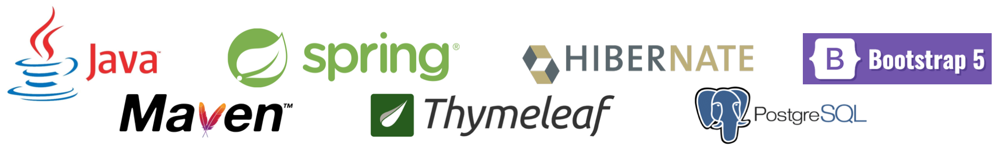

### Архитектура приложения трехслойная
- Слой контроллеры
- Слой сервисы
- Слой работы с БД

### Требуемое окружение
- JDK 17
- Apache Maven 3.8.5
- PostgreSQL 13
- Браузер

### Подготовка к запуску приложения
- Создать БД accidents хост `jdbc:postgresql://localhost:5432/accidents`
- Собрать jar с приложением, выполнив команду `mvn install`
- Запустить приложение из папки target, выполнив команду: `java -jar job4j_accidents-1.0-SNAPSHOT.jar`
- Перейти в браузере по ссылке `http://localhost:8080/accidents/index`

### Таблицы PostgreSQL DB
Таблицы базы данных написаны с помощью Liquibase. Схема БД:
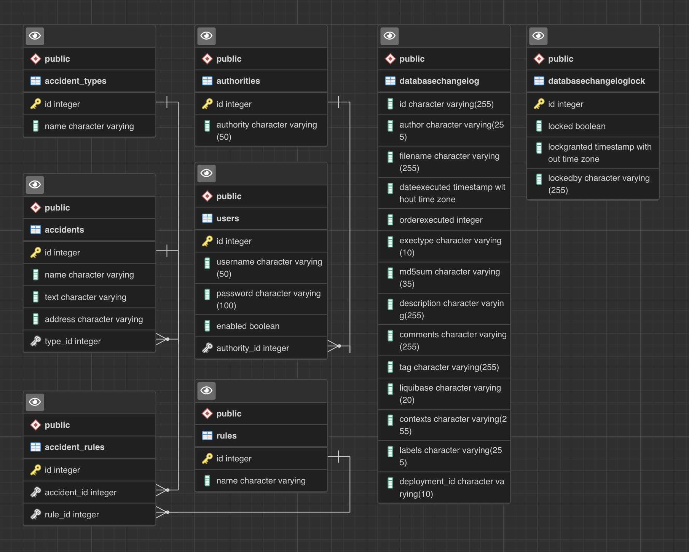

### Список инцидентов
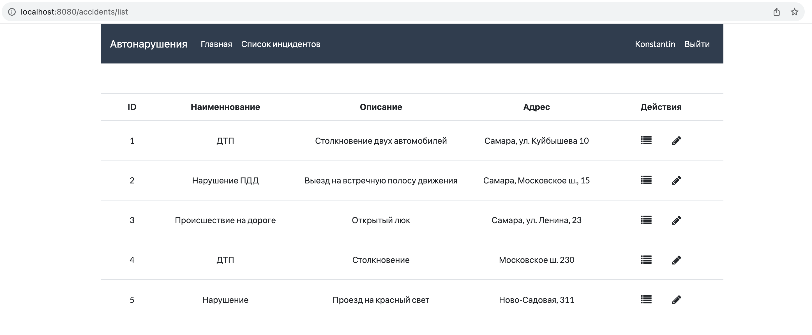

### Детальная информация по инциденту
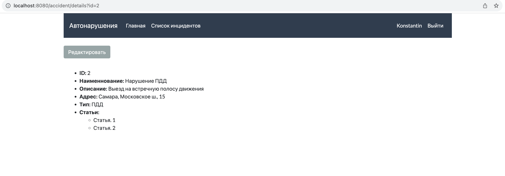

### Создание нового инцидетна
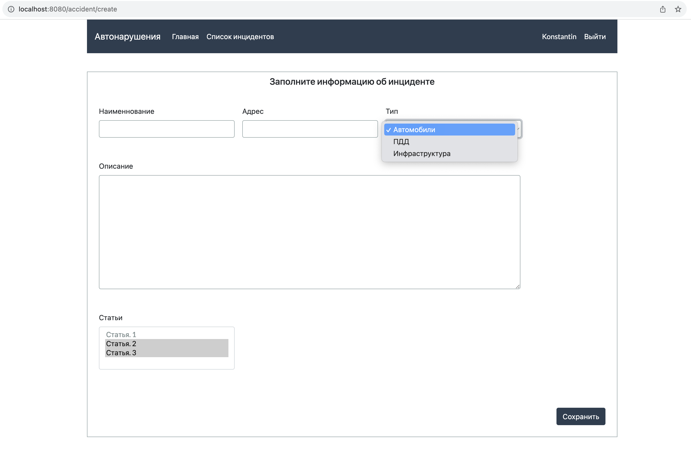

### Редактирование инцидетна
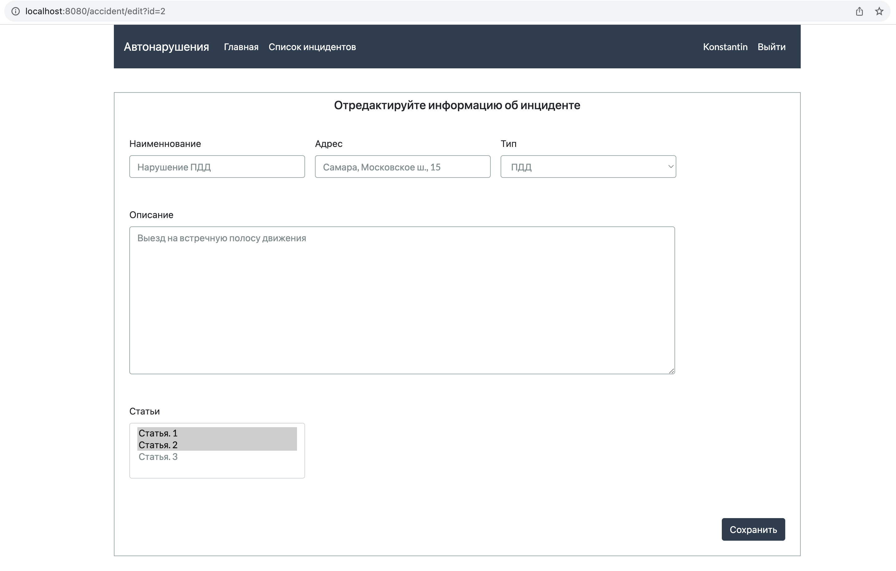

### Приветствие
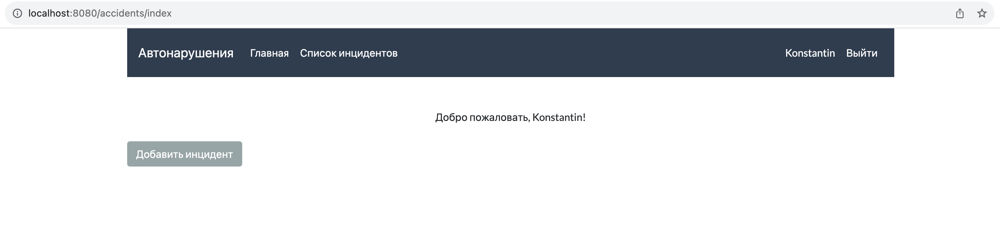

### Авторизация пользователя
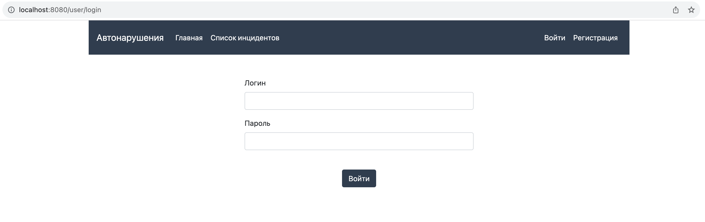

### Ошибка при авторизации пользователя
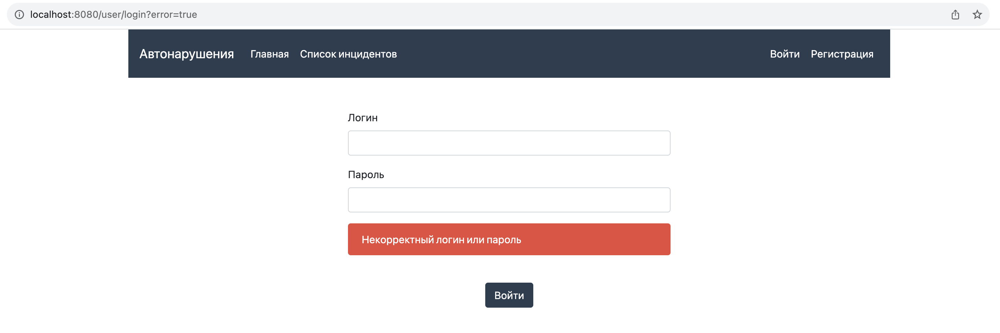

### Выход из системы
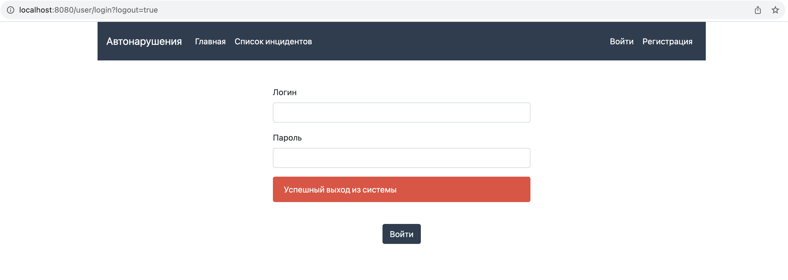

### Регистрация нового пользователя
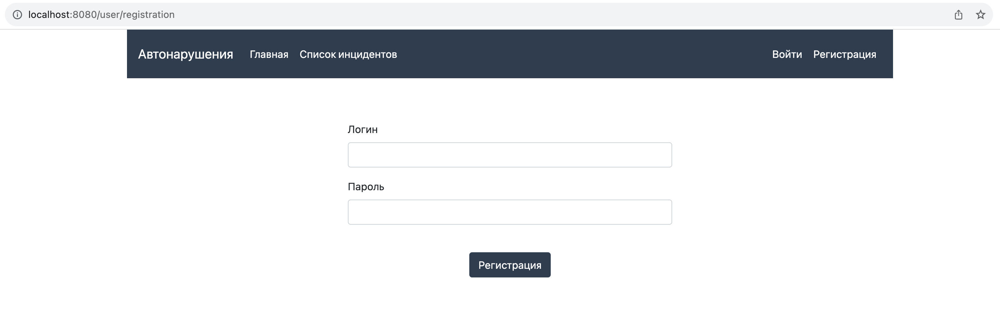

### Ошибка при регистрации нового пользователя
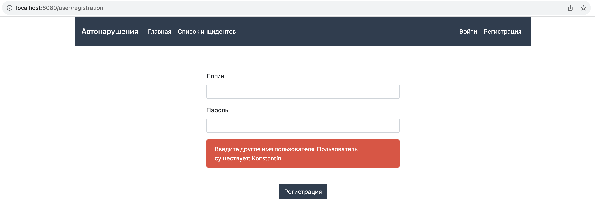

### Контакты
- kanmikhaylov@gmail.com
- [telegram](https://t.me/KonstantinM1khaylov) 

[actions-image]: https://github.com/kamikhaylov/job4j_accidents/actions/workflows/maven.yml/badge.svg
[actions-url]: https://github.com/kamikhaylov/job4j_accidents/actions/workflows/maven.yml
[codecov-image]: https://codecov.io/gh/kamikhaylov/job4j_accidents/graph/badge.svg?token=OOJSR71PZJ
[codecov-url]: https://codecov.io/gh/kamikhaylov/job4j_accidents
